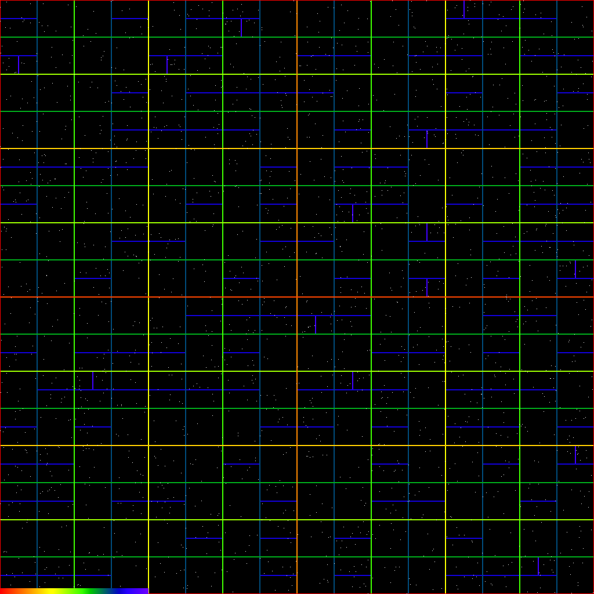
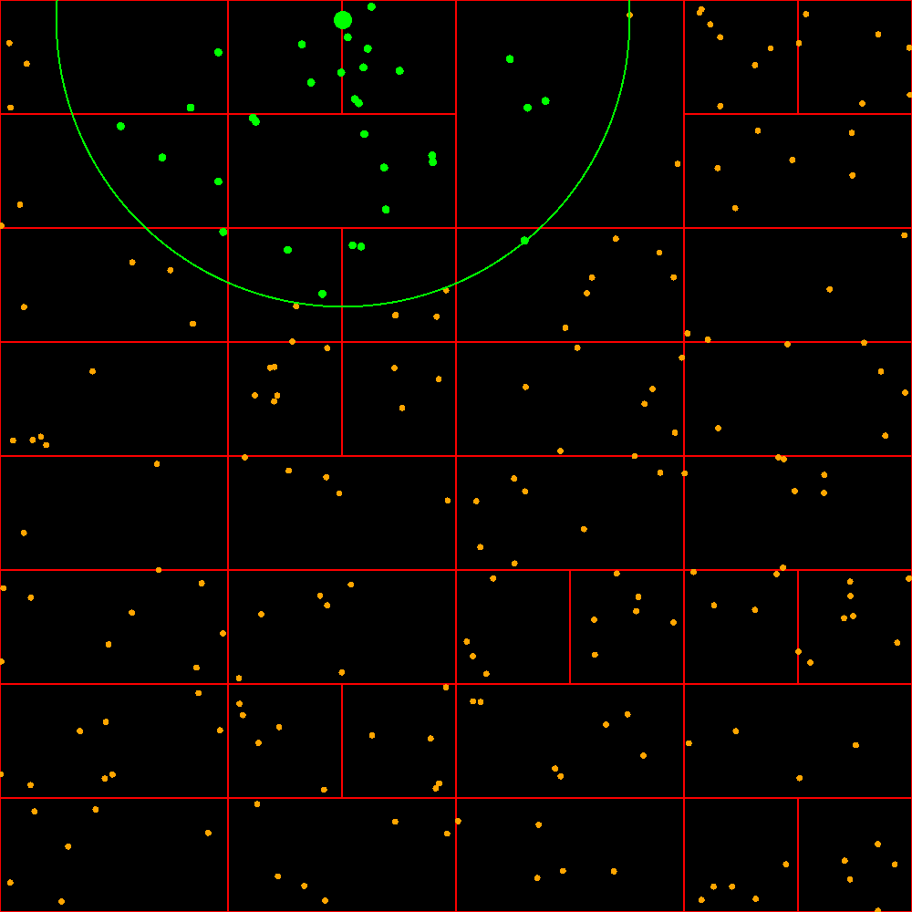
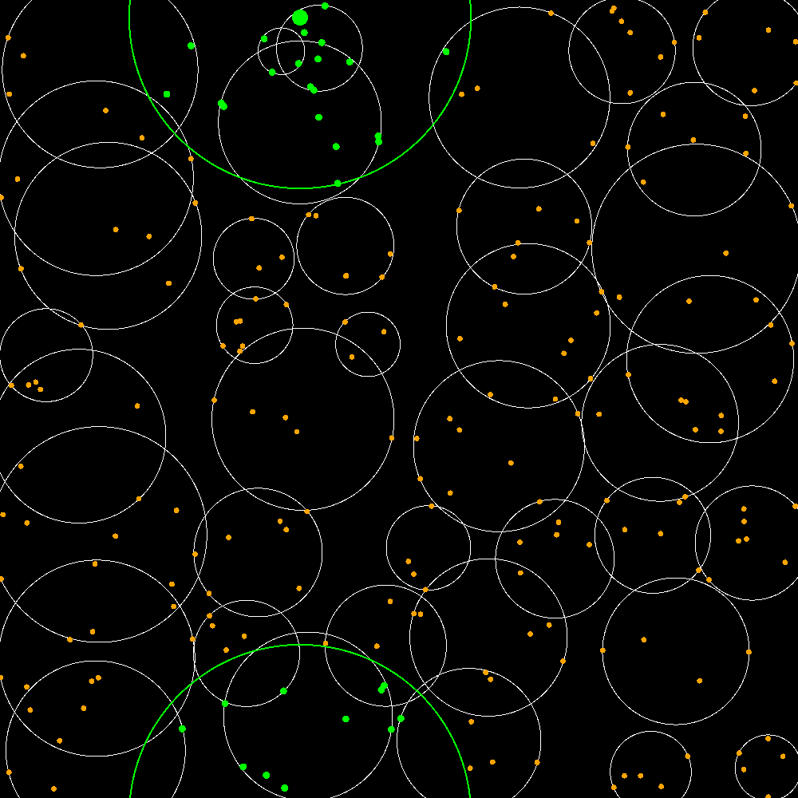
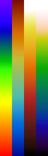
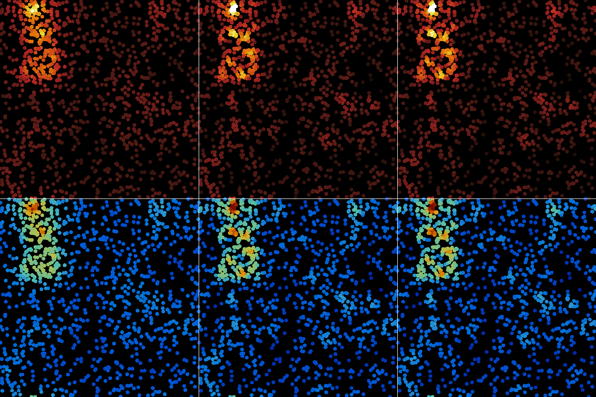
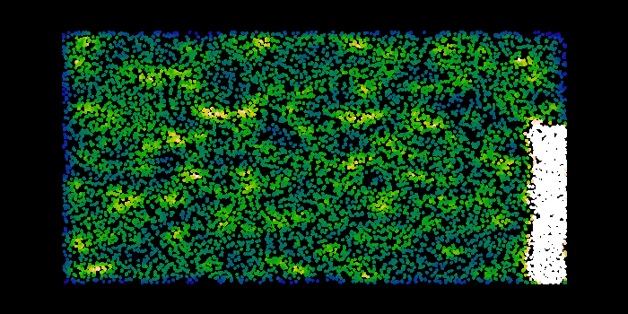
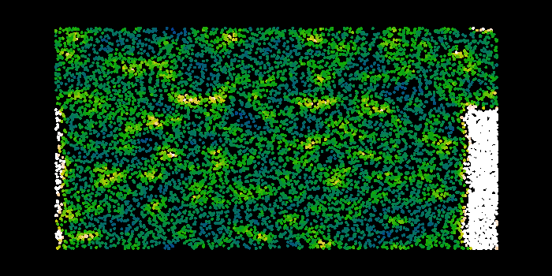

# SPHUGO

**S**mooth **P**article **H**ydrodynamics **U**sing **GO**

Source code available at (www.github.com/bbeni/sphugo)

## Quick Start

```console
go build ./simviewer/
```

The resulting executable is independent of where it's run. It will generate an example.sph-config file where it's run. Configurations can be loaded in the simviewer program - they have to be in the folder it's run from. The example.sph-config can be modified using a text editor and should show what is possible, while serving as documentation.

Linux/MacOs:

```console
./simviewer
```

Windows:

```console
./simviewer.exe
```

# Tasks leading to final code

This ws my attempt at the assignments of ESC 202 course at UZH written in [GO](https://go.dev/ "Go Language"). 🦆 The Goal was to have a working Smooth Particle Hydrodynamics (SPH) code. GO as a language was chosen to easily parallelize the simulation and have fast execution times comparable to C/C++. There are 5 tasks leading up to the simulation. The following sections should provide documentation of the implementation process.

## 1. Task - Binary Partition 2d Particles

Goal:

>Build a binary tree of cells using the partitioning of particles function we introduced in class. The hard part is making sure your partition function is really bomb proof, check all “edge cases” (e.g., no particles in the cell, all particles on one side or other of the partition, already partitioned data, particles in the inverted order of the partition, etc…). Write a boolean test functions for each of these cases. Call all test functions in sequence and check if they all succeed. Once you have this, then recursively partition the partitions and build cells linked into a tree as you go. Partition alternately in x and y dimensions, or simply partition the longest dimension of the given cell.

partitions 2200 uniformely distributed particles in a 2d space and generates tree.png.

```console
go run ./examples/tree-partition/
```

The function Partition() partitions an array of type Particle based on their 2d position. They are compared to a pivot value called middle in a "bubble sort like" manner in a specified axis that can either be "Vertical" or "Horizontal". Returns two partitioned slices a, b. The tests should cover most edge cases (run ```go test -v ./tg```).

The function Treebuild() recurses and partitions an array of N_PARTICLES length int Cells that have maximally MAX_PARTICLES_PER_CELL particles. The SPLIT_FRACTION determines the fraction of space in the specific direction for left/total or top/total.

### Visualisation

A png picture is generated from a tree with the MakeTreePng() function. The following parameters are used for generating the picture:

	N_PARTICLES = 2200
	MAX_PARTICLES_PER_CELL = 8
	SPLIT_FRACTION = 0.5
	IMAGE_W = 512*2
	IMAGE_H = 512*2

#### Treebuild visualization




## 2. Task - Nearest Neighbours

Goal:

>Implement the k nearest neighbor search. Use the priority queue given in the Python template and implement “replace” and “key” functions. Use the particle to cell distance function from the lecture notes or the celldist2() given in the Python template. Are they the same? Optional: Also implement the ball search algorithm given in the lecture notes.

First a heap data structure was implemented to later use as a priority queue for searching the nearest neighbours.

### Heap Implementation

Showcase BuildHeap, Insert, ExtractMin, Replace functionality. The Dumptree function is used for visualizing the tree in terminal (text form) and check for correctness.

```console
go run ./examples/heap/
```

Output of this example:

```console

initial array was:    [31 37 82 83 33 54 39 42 62 49 84 59 88 26 27 21 92 97 87 49 33 9 42 49 88 67]
after heapification:  [9 21 26 31 33 49 27 42 62 37 33 54 67 39 82 83 92 97 87 49 49 84 42 59 88 88]

visualisation to check for correctness:

                          [Root Node]
                               9                               

                /                              \                
               21                              26               

        /              \                /              \        
       31              33              49              27       

    /      \        /      \        /      \        /      \    
   42      62      37      33      54      67      39      82   

  /  \    /  \    /  \    /  \    /  \    /
 83  92  97  87  49  49  84  42  59  88  88 


Insert 0 into the Heap:

                          [Root Node]
                               0                               

                /                              \                
               21                              9               

        /              \                /              \        
       31              33              26              27       

    /      \        /      \        /      \        /      \    
   42      62      37      33      54      49      39      82   

  /  \    /  \    /  \    /  \    /  \    /  \  
 83  92  97  87  49  49  84  42  59  88  88  67 


ExtractMin from Heap:


                          [Root Node]
                               9                               

                /                              \                
               21                              26               

        /              \                /              \        
       31              33              49              27       

    /      \        /      \        /      \        /      \    
   42      62      37      33      54      67      39      82   

  /  \    /  \    /  \    /  \    /  \    /
 83  92  97  87  49  49  84  42  59  88  88 


Replace with 33 with root node:


                          [Root Node]
                               21                               

                /                              \                
               31                              26               

        /              \                /              \        
       33              33              49              27       

    /      \        /      \        /      \        /      \    
   42      62      37      33      54      67      39      82   

  /  \    /  \    /  \    /  \    /  \    /
 83  92  97  87  49  49  84  42  59  88  88 

```

The function `FindNearestNeighbours()` acts on one Particle and uses a prority queue, implemented similarly to the heap shown before, to find the lowest distance neighbours. The NN_SIZE=32 constant defines the nearest neighbours count.

```console
go run ./examples/nearest-neighbours/
```

It generates two images with 220 particles. One random particle is chosen and the 32 nearest neighbours are displayed in gree. The first picture shows the non periodic version of the particle.FindNearestNeighbours function. The tree cells are also shown in red:



The periodic visualization includes the bounding 'sphere' of each tree cell leaf instead of the tree cells:



## 3. Task - Density Calculation

Goal:

>For each particle calculate the “top-hat” density from the 32 nearest neighbors and plot it using a colormap. We will need the density to implement SPH so it needs to be well tested. Also, make sure it can work with periodic boundary conditions! Design the program such that you can easily switch the kernel function (we will look at Monaghan and Wendtland kernels).
>Now, calculate the density using the Monaghan kernel defined in the lecture. Plot and compare to the density you get from the “top-hat” kernel (the Monaghan result should be a little smoother).



For the visualization four color maps are introduced in the gx module: RainbowRamp, ParaRamp, HeatRamp and ToxicRamp (in this order in the picture on the right). The color maps are functions that output 256 distinct colors , based on the input going from 0 to 255.

The color map picture is generated with

```console 
go run ./examples/color-ramp/
```

### Density

The densities of the three kernels - Top Hat, Monahan and Wendtland - are displayed left to right. The row on top uses The ParaRamp color map (most dense: red), whereas the bottom row uses the HeatRamp (most dense: white). Wendtland and Monahan seem to produce much more detailed and structured densities compared to Top Hat.



To test the periodic boundary conditions two further images are generated using Top Hat density, the first upper is using the non periodic version of the density calculation and the lower one the periodic. We clearly see the peroidicity influencing the densities on the other side.




The color density comparison pictures are generated with

```console 
go run ./examples/density/
```

## Tests

To run all tests (Partition(), BoundingSpheres() covered for now):

```console
go test -v ./...
```
