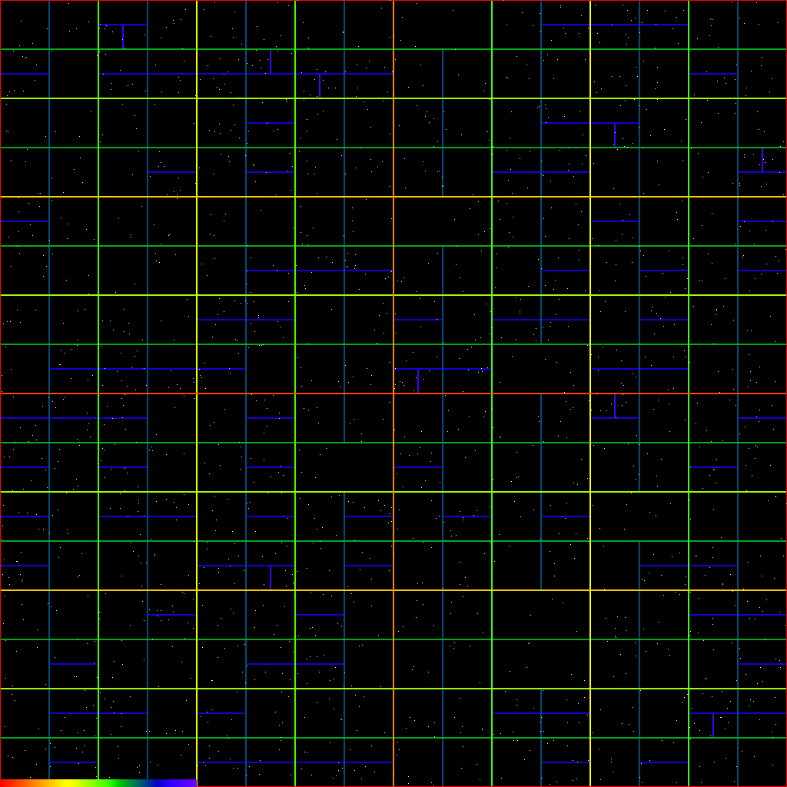

# ESC 202 Simulations

My attempt at the assignments at ESC 202 course at UZH written in [GO](https://go.dev/ "Go Language"). 🦆 The Goal seems to be to have a working Smooth Particle Hydrodynamics code. Go as a language was chosen to easily parallelize the simulation and have fast compiled code.

## 1. Example - Binary Partition 2d Particles

Goal:

>Build a binary tree of cells using the partitioning of particles function we introduced in class. The hard part is making sure your partition function is really bomb proof, check all “edge cases” (e.g., no particles in the cell, all particles on one side or other of the partition, already partitioned data, particles in the inverted order of the partition, etc…). Write a boolean test functions for each of these cases. Call all test functions in sequence and check if they all succeed. Once you have this, then recursively partition the partitions and build cells linked into a tree as you go. Partition alternately in x and y dimensions, or simply partition the longest dimension of the given cell.

partitions 2200 uniformely distributed particles in a 2d space and generates tree.png.

```console
go run ./examples/tree-partition/
```

The function Partition() partitions an array of type Particle based on their 2d position. They are compared to a pivot value called middle in a "bubble sort like" manner in a specified axis that can either be "Vertical" or "Horizontal". Returns two partitioned slices a, b. The tests should cover most edge cases (run ```go test -v ./tg```).

The function Treebuild() recurses and partitions an array of N_PARTICLES length int Cells that have maximally MAX_PARTICLES_PER_CELL particles. The SPLIT_FRACTION determines the fraction of space in the specific direction for left/total or top/total.

### Visualisation

A png picture is generated from a tree with the MakeTreePng() function. The following parameters are used for generating the picture:

	N_PARTICLES = 2200
	MAX_PARTICLES_PER_CELL = 8
	SPLIT_FRACTION = 0.5
	IMAGE_W = 512*2
	IMAGE_H = 512*2

#### Treebuild visualization



## 2. Example - Heap

Showcase BuildHeap, Insert, ExtractMin, Replace functionality. Dumptree function used for visualizing the tree in terminal (text form) and check for correctness.

```console
go run ./examples/heap/
```

## Tests

To run all tests (only Partition function covered for now):

```console
go test -v ./...
```